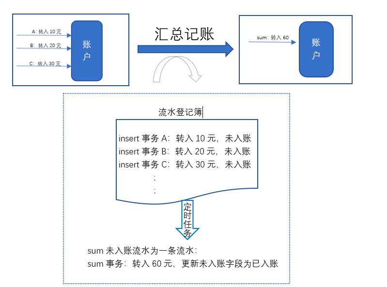

把热点账户按照金额变动方向分为三种账户
* 加频账户（余额增加频繁）
* 减频账户（余额扣减频繁）
* 双频账户（余额增加扣减均频繁）

## 加频账户推荐
solution 1: 汇总明细入账

solution 2: 异步mq缓冲入账

##  减频账户推荐
solution 1:拆分子账户 

额外处理
1. 子账户余额不足是，异步做子账户的资金归集  
* 如果归集之后仍然不够，拆分扣款总额吗？

# Reference: 
1. https://zhuanlan.zhihu.com/p/257138102
2. https://zhuanlan.zhihu.com/p/82652525
3. https://zhuanlan.zhihu.com/p/210879230